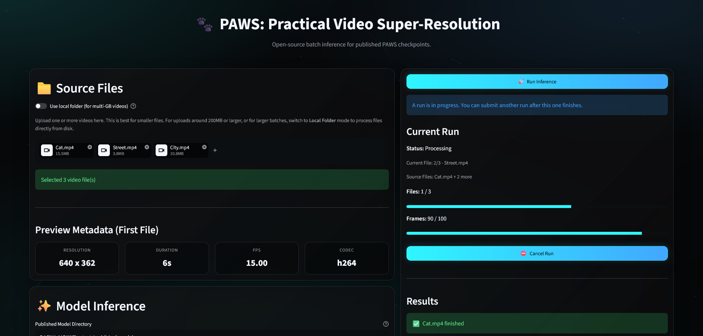

# 🐾 PAWS: Practical Video Super-Resolution

[](paper/PAWS_RealBasicVSRPP_Paper.pdf)
[](https://huggingface.co/jnguyen5650/PAWS)



## Project Overview

PAWS is a modular video super-resolution framework for research and deployment. It supports arbitrary power-of-two upscaling and provides config-driven training, testing, evaluation, and model-publishing workflows. Generators, discriminators, optical-flow backends, losses, degradation pipelines, and tiled inference settings are defined through YAML configs which enables a wide range of VSR architectures and experimental protocols.

The current paper model, PAWS RealBasicVSR++, focuses on practical real-world VSR under consumer-GPU constraints. It combines low-resolution cleaning, BasicVSR++ recurrent restoration, RAPIDFlow alignment, video-aware adversarial training, no-reference/temporal evaluation, and Pareto-guided checkpoint selection. The broader framework also supports additional generator designs, discriminator variants, degradation settings, and inference workflows.


## 💡 Key Features

- **Flexible, modular design:** Config-driven pipeline for swapping or extending generators, discriminators, optical-flow models, losses, degradations, datasets, and inference settings.
- **Efficient and deployment-aware:** Designed for practical training and inference on consumer-grade hardware, with tiled inference, overlap padding, precision controls, and optional `torch.compile`.
- **Custom dataset and degradation pipelines:** Supports paired video datasets, synthetic degradations, real-world degradation recipes, and extensible data transforms.
- **Distortion, perceptual, and adversarial training:** Supports PSNR-style training, perceptual losses, GAN training, EMA weights, AMP/FP32 training, checkpoint resume, and single-process or DDP execution.
- **Evaluation and checkpoint selection tools:** Includes full-reference metrics, no-reference metrics, video-quality scoring, optical-flow temporal diagnostics, and coarse-to-fine checkpoint search.
- **Model publishing and app inference:** Packages trained generator or EMA weights into portable `.paws.pth` artifacts for the demo inference app.
- **Experiment tracking and reproducibility:** Integrated TensorBoard scalars, image logging, GPU memory tracking, structured configs, checkpoints, and reusable command-line utilities.
- **Open-source friendly:** Clear repo structure and documented workflows for research, experimentation, and deployment.


## 🎥 Demo Videos

See PAWS RealBasicVSR++ in action on real-world video content. These demo clips show input and output comparisons.

https://github.com/user-attachments/assets/5d870192-c451-46c5-afa4-ed76df7858dc

https://github.com/user-attachments/assets/b8b31f8c-464a-4da5-b255-8077bd143a37

https://github.com/user-attachments/assets/5b17b6ec-01b7-452f-b855-612a4d8df722

> [!NOTE]  
> Demo videos are compressed for web viewing and may not fully represent the quality of actual model outputs.


## 📦 Installation and Setup

Python 3.12 is recommended. Install the PyTorch stack before the rest of the dependencies to avoid accidentally installing CPU-only builds, especially on Windows.

1. Create and activate a Python 3.12 environment:

```bash
conda create -n paws python=3.12
conda activate paws
```

2. Install PyTorch, TorchVision, and TorchAudio using the official [PyTorch Start Locally](https://pytorch.org/get-started/locally/) selector, or use the CUDA 12.6 example below.

```bash
python -m pip install torch==2.10.0 torchvision==0.25.0 torchaudio==2.10.0 --index-url https://download.pytorch.org/whl/cu126
```

If you need a different CUDA target, use the matching PyTorch index URL.

3. Install the remaining requirements, then install the pinned COVER dependency with `--no-deps`:

```bash
python -m pip install -r requirements.txt
python -m pip install --no-deps "cover @ git+https://github.com/taco-group/COVER.git@7373bee6bc55fdc2b617e40c8c45c8295c5e6467"
```

The `--no-deps` flag prevents pip from trying to satisfy COVER's older `torch~=1.13` dependency constraint after the correct PyTorch build is already installed.


## 🔥 Quick Start: Training

Training is driven by YAML config files under `configs/`. The config defines the model, dataset paths, dataloader settings, losses, checkpoint behavior, and logging name.

For single-process training, pass the config path directly to `train.py`:

```bash
python train.py configs/PAWS_RealBasicVSRPP_HAT_Stage1_PSNR_REDSx4.yaml
```

For distributed data parallel training, launch `train_ddp.py` with `torchrun`. Set `--nproc_per_node` to the number of GPU processes to run, typically one process per GPU:

```bash
torchrun --nproc_per_node=2 train_ddp.py configs/PAWS_RealBasicVSRPP_HAT_Stage1_PSNR_REDSx4.yaml
```

If you need to select specific GPUs, set `CUDA_VISIBLE_DEVICES` before launching. If the default distributed port is already in use, pass a different `--master_port` value to `torchrun`.

Prepare paired low-resolution and high-resolution frame folders that match the paths in `dataset.train` and `dataset.val`:

```text
data/REDS/
|-- lr/
|   |-- train/
|   |   |-- <sequence_id>/
|   |   |   |-- <frame>.png
|   |-- val/
|   |   |-- <sequence_id>/
|   |   |   |-- <frame>.png
|-- hr/
|   |-- train/
|   |   |-- <sequence_id>/
|   |   |   |-- <frame>.png
|   |-- val/
|   |   |-- <sequence_id>/
|   |   |   |-- <frame>.png
```

Each LR sequence folder should have a matching HR sequence folder with frames sorted by filename. HR frame dimensions must equal the LR dimensions multiplied by `model.scale_factor`.

Checkpoints are written to `training.save_checkpoint_dir`, final weights are written to `training.final_model_dir`, and TensorBoard logs use `logging.name` under `logs/`.


## 🧪 Quick Start: Testing

Testing uses `test.py` with the same config file used to define the model and test paths. Pass both the config path and the trained generator checkpoint:

```bash
python test.py configs/PAWS_RealBasicVSRPP_HAT_Stage1_PSNR_REDSx4.yaml outputs/PAWS_RealBasicVSRPP_HAT_Stage1_PSNR_REDSx4_G_EMA.pth
```

Use the `_G.pth` checkpoint instead of `_G_EMA.pth` if you want to test the non-EMA generator.

Common optional arguments include `--tile_t`, `--tile_h`, and `--tile_w` for tiled inference; `--pad_t`, `--pad_h`, and `--pad_w` for tile overlap; `--precision {fp32,bf16,fp16}` for inference precision; and `--compile_mode {none,default,reduce-overhead,max-autotune}` for optional `torch.compile` support.

Example tiled inference command:

```bash
python test.py configs/PAWS_RealBasicVSRPP_HAT_Stage1_PSNR_REDSx4.yaml outputs/PAWS_RealBasicVSRPP_HAT_Stage1_PSNR_REDSx4_G_EMA.pth --tile_t 0 --tile_h 256 --tile_w 256 --pad_h 20 --pad_w 20
```

Prepare test input frames under `dataset.test.lr_dir`. Super-resolved frames are saved under matching sequence folders in `dataset.test.hr_dir`:

```text
data/REDS/
|-- lr/
|   |-- test/
|   |   |-- <sequence_id>/
|   |   |   |-- <frame>.png
|-- hr/
|   |-- test/
|   |   |-- <sequence_id>/
|   |   |   |-- 00000000.png
```

Input frames are sorted by filename before inference. Output frames are written as PNG files named `00000000.png`, `00000001.png`, and so on.


## 🎬 Demo App

Use the Streamlit demo app for easy inference on video files. This is the recommended path when you want to process videos directly instead of preparing image frame sequences for `test.py`.

> [!IMPORTANT]
> **Local use only.** This demo app is intended for local development and testing. 
> It is not hardened for production deployment, network exposure, or untrusted input.

Before launching the app, publish a compatible `.paws.pth` model artifact:

```bash
python -m tools.publish_model --config configs/PAWS_RealBasicVSRPP_HAT_Stage1_PSNR_REDSx4.yaml --ckpt outputs/PAWS_RealBasicVSRPP_HAT_Stage1_PSNR_REDSx4_G_EMA.pth --which EMA
```

Published models are written to `outputs/published_models/` by default, which is also the app's default model directory.

The demo app only loads `.paws.pth` artifacts created by `tools/publish_model.py`. It will not load direct checkpoints from the training scripts or generator state dicts produced by `tools/extract_submodel.py`.

Launch the app with:

```bash
streamlit run app/app.py
```

In the UI, select a published model, upload supported video files or switch to local-folder mode, choose tiling/runtime/export settings, and save either output videos or PNG frame sequences. By default, outputs are written under `~/Downloads/PAWS_Upscaled_Videos`, but you can choose another output directory in the app.


## ✨ Updates

- **July 21, 2026:** Added the Streamlit demo app for batch video inference on published model artifacts.
- **July 17, 2026:** Released model weights on [HuggingFace](https://huggingface.co/jnguyen5650/PAWS). Added demo videos and updated the [PAWS RealBasicVSR++ paper](paper/PAWS_RealBasicVSRPP_Paper.pdf).
- **June 30, 2026:** Added the [PAWS RealBasicVSR++ paper](paper/PAWS_RealBasicVSRPP_Paper.pdf), covering the current model, evaluation protocol, and release checkpoints.
- **June 1, 2026:** Expanded the PAWS training, inference, and evaluation workflow. Added REDS x4 configs for RealBasicVSR++, SSIM loss support, tiled and precision-aware testing with optional `torch.compile`, full-reference/no-reference/Ewarp benchmarking, COVER scoring, checkpoint search, portable model publishing, pinned requirements, and torchrun-compatible DDP launch handling.
- **January 23, 2026:** Added RealBasicVSR++ architecture with modular cleaning backends (RRDB, SwinIR, HAT) and dynamic refinement. Major refactor of model registry, training compatibility, and checkpointing with correct mid-epoch resume support.
- **June 23, 2025:** Added inference script for test-time video super-resolution
- **May 31, 2025:** Project repository initialized - dataset, training, modular config, and model registry


## 🤖 Model Zoo

| Model | Backbone | Config | Download | Notes |
| ------------ | ------------ | ------------ | ------------ | ------------ |
| PAWS RealBasicVSR++-HAT-LPIPS-TRes | RealBasicVSR++ | `configs/PAWS_RealBasicVSRPP_HAT_Stage2_GAN_REDSx4.yaml` | [EMA](https://huggingface.co/jnguyen5650/PAWS/resolve/main/PAWS_RealBasicVSRPP_HAT_Stage2_LPIPS_TRes_REDSx4_G_EMA.pth?download=true) / [App](https://huggingface.co/jnguyen5650/PAWS/resolve/main/published_models/PAWS_RealBasicVSRPP_HAT_Stage2_LPIPS_TRes_REDSx4_G_EMA.paws.pth?download=true) | Recommended model |
| PAWS RealBasicVSR++-HAT-Stage1-PSNR | RealBasicVSR++ | `configs/PAWS_RealBasicVSRPP_HAT_Stage1_PSNR_REDSx4.yaml` | [EMA](https://huggingface.co/jnguyen5650/PAWS/resolve/main/PAWS_RealBasicVSRPP_HAT_Stage1_PSNR_REDSx4_G_EMA.pth?download=true) | Pre-GAN checkpoint |
| PAWS RealBasicVSR++-HAT-LPIPS-TAvg | RealBasicVSR++ | `configs/PAWS_RealBasicVSRPP_HAT_Stage2_GAN_REDSx4.yaml` | [EMA](https://huggingface.co/jnguyen5650/PAWS/resolve/main/PAWS_RealBasicVSRPP_HAT_Stage2_LPIPS_TAvg_REDSx4_G_EMA.pth?download=true) | Stage 2 ablation |
| PAWS RealBasicVSR++-HAT-DISTS | RealBasicVSR++ | `configs/PAWS_RealBasicVSRPP_HAT_Stage2_GAN_REDSx4_DISTS.yaml` | [EMA](https://huggingface.co/jnguyen5650/PAWS/resolve/main/PAWS_RealBasicVSRPP_HAT_Stage2_DISTS_REDSx4_G_EMA.pth?download=true) | Stage 2 ablation |
| PAWS RealBasicVSR++-HAT-LPIPS-SpatialD | RealBasicVSR++ | `configs/PAWS_RealBasicVSRPP_HAT_Stage2_GAN_REDSx4_SpatialDiscriminator.yaml` | [EMA](https://huggingface.co/jnguyen5650/PAWS/resolve/main/PAWS_RealBasicVSRPP_HAT_Stage2_LPIPS_SpatialD_REDSx4_G_EMA.pth?download=true) | Stage 2 ablation |

EMA files are raw generator weights for `test.py` and research workflows. The App download is a portable `.paws.pth` artifact for the PAWS app/demo loader.

LPIPS-TAvg and LPIPS-TRes share the same base Stage 2 LPIPS config. They differ by the discriminator-output behavior used when the released checkpoints were trained.


## 📝 Citation

If you use these weights or the PAWS codebase, please cite the PAWS preprint:

```bibtex
@article{nguyen2026paws,
  title={PAWS: Practical Real-World Video Super-Resolution with Modular Cleaning},
  author={Nguyen, Justin},
  journal={Preprint},
  year={2026}
}
```

## ⚖️ License and Acknowledgements

This project is released under the Apache 2.0 license.
See the [NOTICE](NOTICE.md) file for acknowledgements and third-party code attributions.
